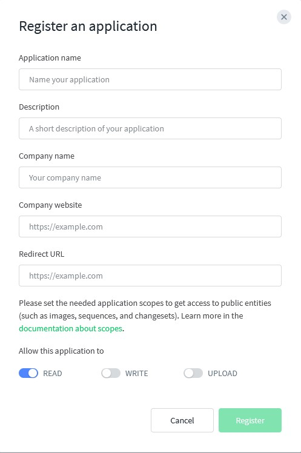
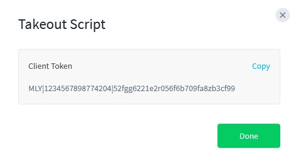
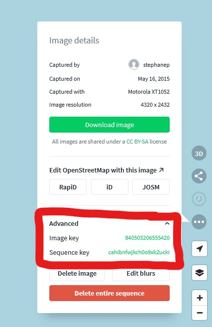

# mapillary_download
Simple code to download images in one or several mapillary sequences. The images will be geotagged and oriented.

## How to use
change the access token with your access token and the sequence ids with the ids of the sequences you want to download
```Shell
python mapillary_download.py "MLY|xxxx|xxxxxxx" --sequence_ids xxxxxxxxxxx xxxxxxxxxxx
```

## Available arguments
```Shell
python mapillary_download.py -h
usage: mapillary_download.py [-h] [--sequence_ids [SEQUENCE_IDS ...]] [--image_ids [IMAGE_IDS ...]] [--destination DESTINATION]
                   [--image_limit IMAGE_LIMIT] [--overwrite]
                   access_token

positional arguments:
  access_token          Your mapillary access token

optional arguments:
  -h, --help            show this help message and exit
  --sequence_ids [SEQUENCE_IDS ...]
                        The mapillary sequence id(s) to download
  --image_ids [IMAGE_IDS ...]
                        The mapillary image id(s) to get their sequence id(s)
  --destination DESTINATION
                        Path destination for the images
  --image_limit IMAGE_LIMIT
                        How many images you want to download
  --overwrite           overwrite existing images
  -v, --version         show program's version number and exit
```

## How to get my access token
 - Go to https://www.mapillary.com/dashboard/developers
 - Click on "Registrer Application", enter the needed informations, enable the application to "Read" data, then click on register :

    
 - When this registration is done, click on "view" in the token column. This is you access token : 

    

## How to get my sequence id (or sequence key)

 - Go to https://mapillary.com/app
 - Click on one of the picture of the sequence you want to download
 - Click on the "image option" button (right panel)
 - Click on "advanced" then click on the sequence key to copy it in the clipboard

    

## How to install the script with a virtual environnement

```Shell
cd ~
git clone https://github.com/Stefal/mapillary_download.git
cd mapillary_download
python3 -m venv mly_venv
source mly_venv/bin/activate
python -m pip install -r requirements.txt
```
Then you can run `python mapillary_download  "MLY|xxxx|xxxxxxx" --sequence_ids xxxxxxxxxxx`
When you're done with the script, simply run `deactivate` to exit the virtual environnement.

On windows you can create a virtual environnement too, or use the prebuilt `mapillary_download.exe` available on the release page.